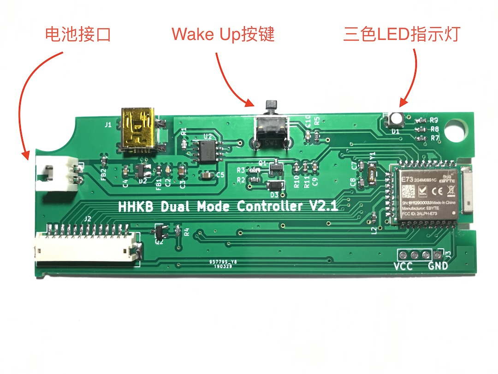
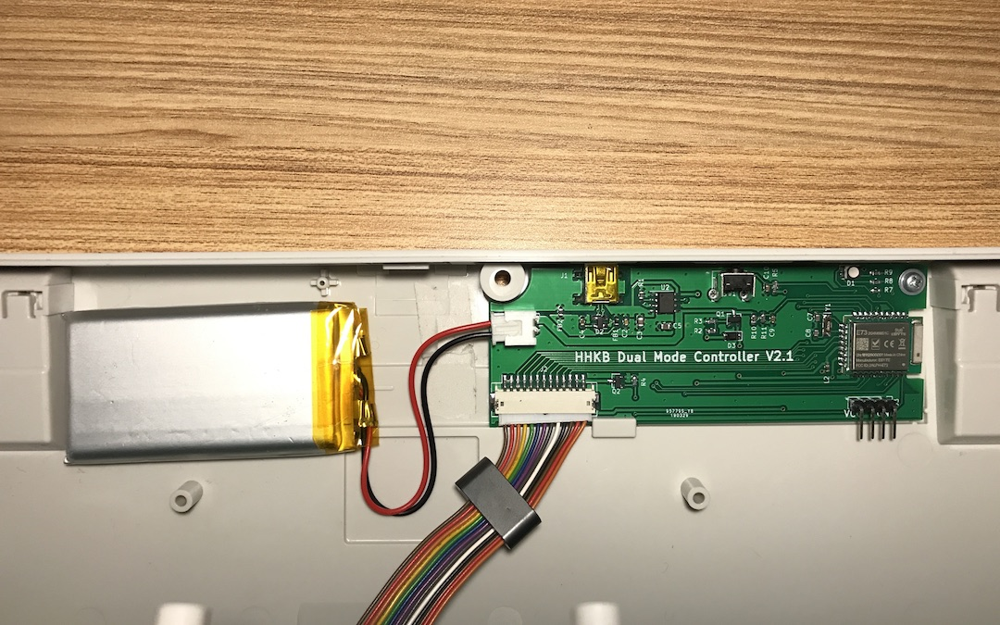

# HHKB Pro2 安装教程
## 更新说明
**20230730:**

硬件从 V3.1 版本开始，升级为 USB-C 接口。由于该接口尺寸大于外壳原有开孔，因此需要对原外壳孔做扩大处理。可使用小刀或矬子等工具处理。
## 主控板

## 安装
首先用螺丝刀拆开外壳，拆下控制板固定螺丝，取下原装控制板。

然后拔掉控制板的排线。排线连接较紧，一只手握住控制板，另一只手握住排线，慢慢用力往外拔就出来了，不用担心会把线拉断。

之后安装上我们自己的控制板，接上排线，最后接上电池。这里特别要注意一下电池的正负极顺序。
**红色线为正极，黑色线为负极。红色线在上方，黑色线在下方。** 务必保证安装好后的电池线序如下图所示：

