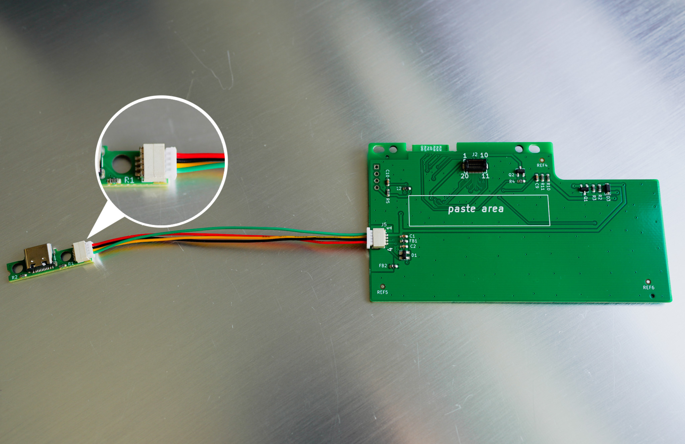
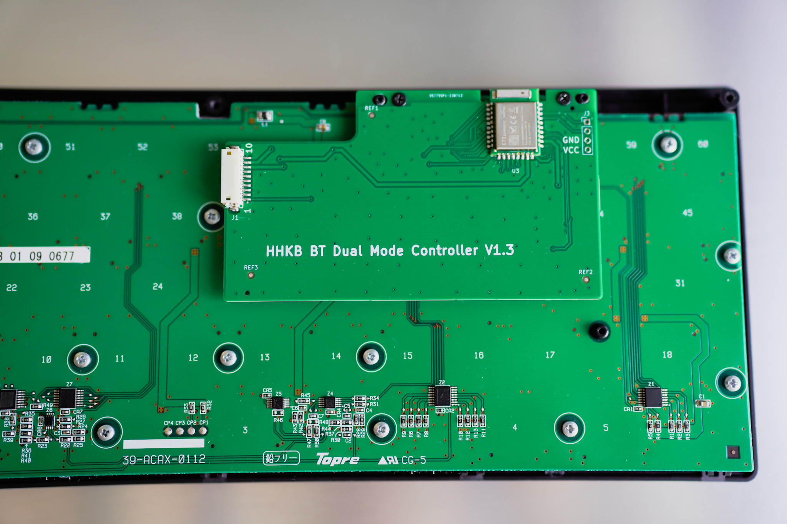
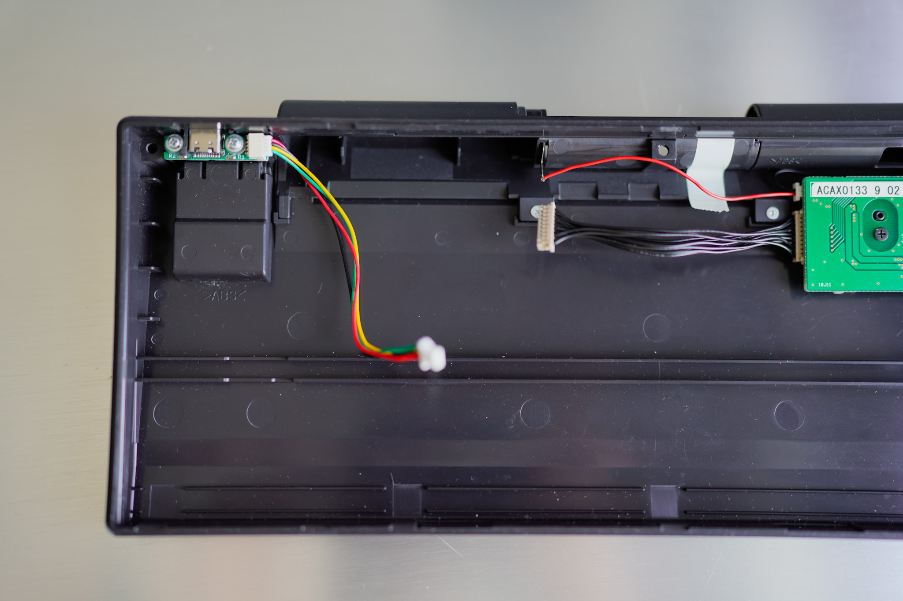
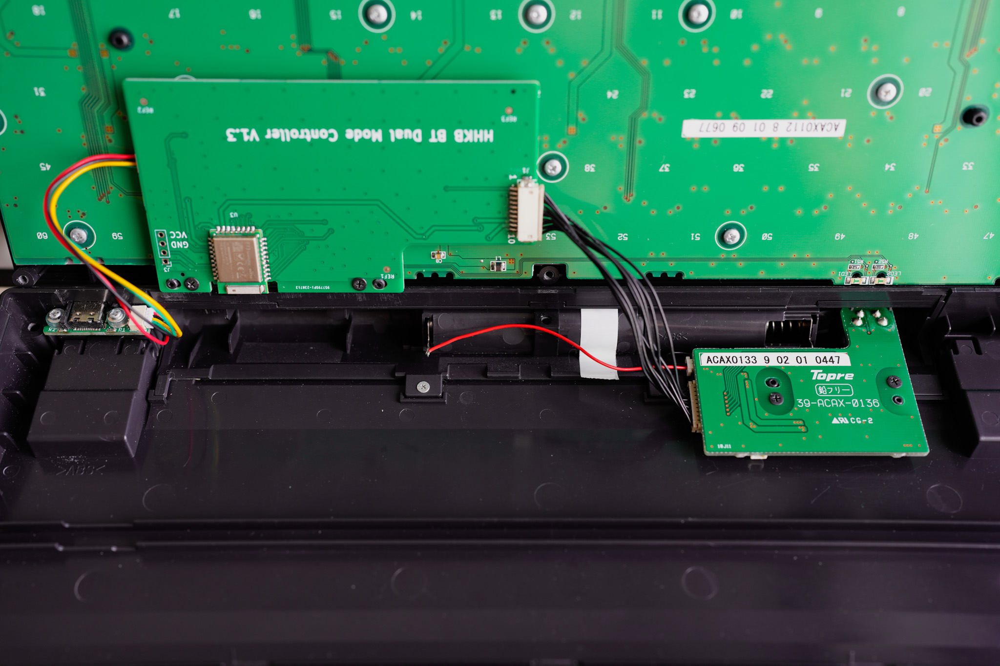

# HHKB Pro BT 安装教程

本教程仅适用于 HHKB Professional BT 键盘改造双模，搭配 HHKB BT DMC 主控使用。该主控[购买链接请点击这里](https://item.taobao.com/item.htm?spm=a21n57.1.0.0.4e88523cYG7I9P&id=725033042681&ns=1&abbucket=16#detail)。

安装分为以下几个步骤：

## 确认硬件连接

图1 USB-C 小板与主控板连接方式
 

收到硬件后，请先按照上图所示，将 USB-C 小板和主控板连接起来。

这一步主要是熟悉一下这个 USB 4 Pin 线的连接方式，注意接口不要插反。

这里要**特别注意**，连接线靠近 USB-C 小板的一端，端子做过处理，要窄一点。请保持收到货时的方向进行连接，否则会导致键盘外壳合不严实。

## 替换原有主控板

图2 主控板安装效果
 

1. 首先拆掉原装主控板

   拆掉两颗螺丝后，会发现主控板仍然不好取下来，请试着稍微用力，慢慢往上拔。

   这是因为主控板底部附着有强力双面胶。该双面胶不要丢弃，接下来安装新主控时请像原先一样用于固定主控板。

2. 安装新主控

   首先将主控板定位孔与外壳定位柱对齐，然后确保底部板与板间的连接器对准，然后稍微用力往下压，确保板对板连接器连接紧密，无明显缝隙。

## 替换 USB 小板

图3 USB-C 小板安装效果
 

1. 拆下原装 Micro USB 电路部分，包括连接线一起整体移除。

2. 尝试安装新的 USB-C 小板。这时会发现装不上，因为新的 USB-C 接口尺寸大于外壳接口开孔。因此需要将该孔扩大，可以使用小刀或矬子等工具进行操作。

3. 最后安装上 USB-C 小板。

## 连接各个端子

图4 整体安装完成后的效果
 

连接左侧 4 Pin USB 端子和右侧 10 Pin 端子。

完成以上几步操作后，即可安装上电池或者连接上 USB 线给键盘通电，然后进行简单的键盘功能测试。待确认键盘可正常使用后，再合上外壳，锁螺丝。

