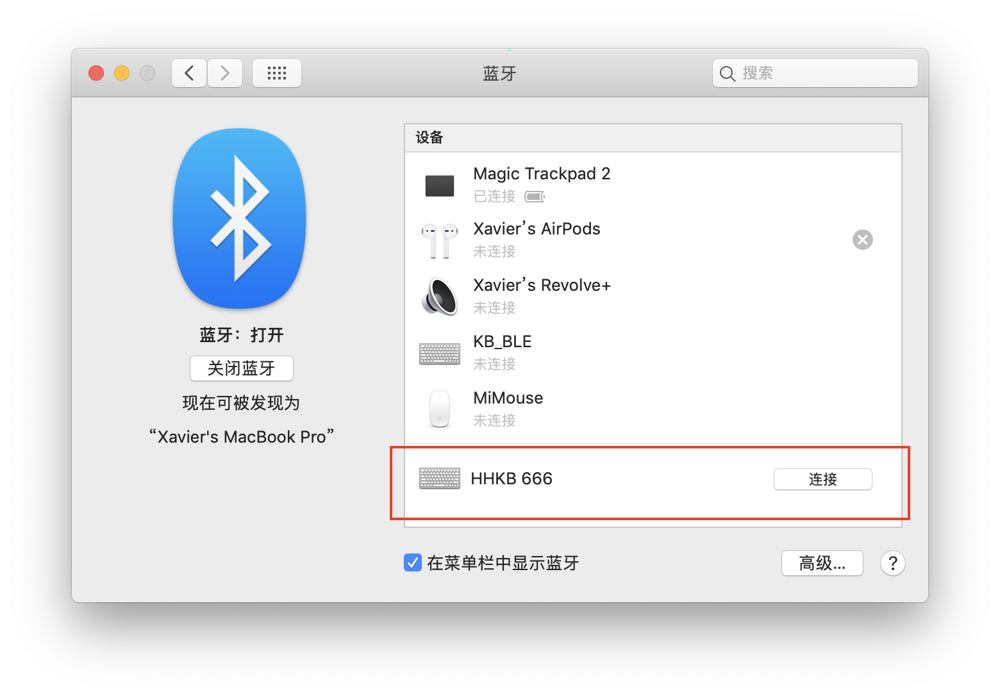

# 使用说明
## 连接
### 蓝牙连接
当控制板接上电池后，蓝色 LED 灯开始闪烁。表示控制板开始工作，等待蓝牙设备进行连接。接下来，以 macOS 平台演示如何连接。

1.首先打开蓝牙偏好设置，可以看到名字以 “HHKB” 开头的键盘设备，这就是我们的键盘。

2.点击连接，等待其连接完成，显示已连接。
接下来，按一下 command+tab 键，若可以进行任务切换，说明键盘可以使用了。

### USB连接
默认情况下，当 USB 未连接时，键盘通过蓝牙输入。当插入 USB 后，键盘自动切换到 USB 输入。拔掉 USB，自动切换到蓝牙输入。

### 输入接口切换
按下 “Fn+右Alt+U” 组合键（U 为 USB 的首字母），手动切换到 USB 输入。
按下 “Fn+右Alt+B” 组合键（B 为 Bluetooth 的首字母），手动切换到蓝牙输入。

## 其它功能说明
1. 连续一段时间无按键操作，键盘将主动断开连接并进入休眠状态。也可以通过按 “Fn+右Alt+S“ 组合键手动进入待机状态。此时耗电量极低，可忽略不计。
2. 待机状态下，键盘不能使用。通过按侧面的 Wake Up 键可唤醒键盘以继续工作，此时会自动连接到最后一次连接的设备。
3. 按 “Fn+右Alt+T” 组合键，可使键盘进入 OTA 模式，此时 LED 指示灯常亮。按 Wake Up 键可退出 OTA 模式。
4. 键盘侧面的 Wake Up 按键为硬件复位功能。当键盘出现异常时，可通过短按此键重启键盘。

## 指示灯说明
红、绿、蓝、橙色 LED，用于指示键盘的工作状态。

 Keyboard|LED|ON|OFF|BLINK
 :--:|:--:|:--:|:--:|:--:
Pro 2|RED|充电中|/|电量低
Pro 2|GREEN|电充满|/|/
Pro 2 / BT|BLUE|/|/|蓝牙未连接
Pro BT|ORANGE|/|/|电量低

