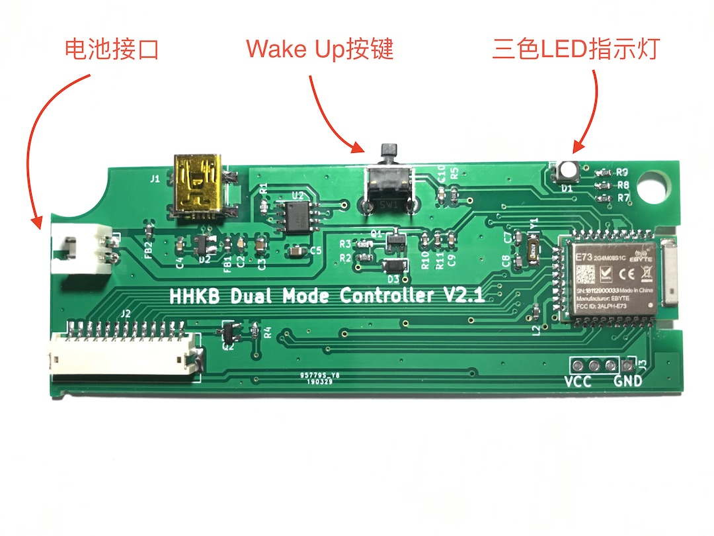
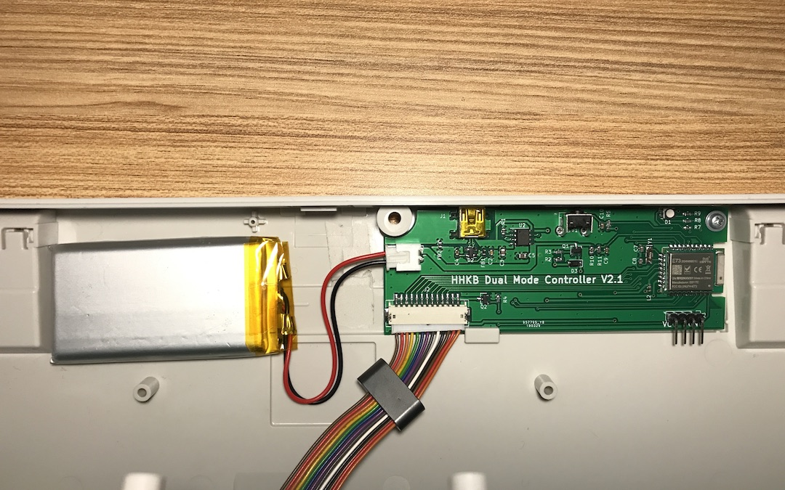

# 安装说明
## 主控板

## 安装
首先用螺丝刀拆开外壳，拆下控制板固定螺丝，取下原装控制板。然后拔掉控制板的排线。排线连接较紧，一只手握住控制板，另一只手握住排线，慢慢用力往外拔就出来了，不用担心会把线拉断。之后安装上我们自己的控制板，接上排线，最后接上电池。这里特别要注意一下电池的正负极顺序。
**红色线为正极，黑色线为负极。红色线在上方，黑色线在下方。** 务必保证安装好后的电池线序如下图所示：

**注**：该控制板除直接替换原有控制板外，未对键盘做任何改动。因此不用担心会对键盘造成其它影响。将原有控制板替换回来，即可恢复到改装前的状态。