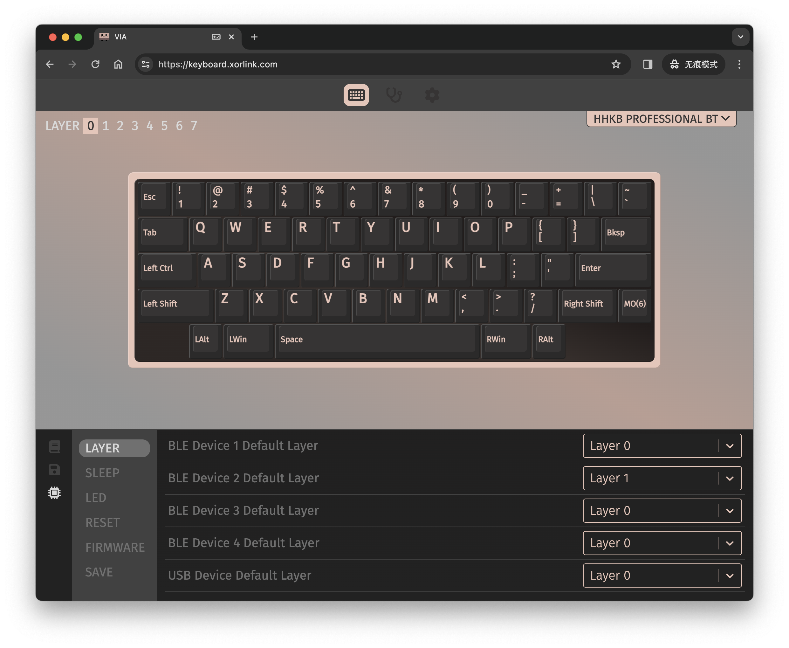

# 键盘配置

Web App 除了可修改键盘键位外，还可以对键盘的功能进行配置。

页面左下角的 `CONFIG` 菜单中，提供了 `LAYER` `SLEEP` `LED` `RESET` `FIRMWARE` `SAVE` 几个菜单。下面依次介绍各个子菜单的功能。
## LAYER
键盘可以连接 4 台蓝牙设备和一台 USB 设备，总共 5 台设备。

如上图所示，可以分别设置每台设备的默认键位层，这样可以实现在切换设备连接时，自动切换键位。

例如设备 1 和设备 2 使用的键位不一样，就可以为这两个设备各分配一层键位。当键盘连接在设备 1 和 2 之间切换时，键位也会随着自动切换。

## SLEEP
### Allow Deep Sleep
配置键盘在自动睡眠时是否进入深度睡眠模式。

打开此开关，则键盘在自动睡眠时会进入深度睡眠模式，此时键盘功耗降到最低，可以忽略不计。但是之后只能通过`Wake-Up`键进行唤醒使用。

关闭此开关，则键盘在自动睡眠时进入轻度睡眠模式，此时键盘功耗比正常工作时低很多，但高于深度睡眠模式。好处是该模式下键盘支持任意键唤醒并响应按键操作。
### Auto Sleep Timeout
可配置 30～240 min 的无按键超时时间。超过该时长一直无按键按下，键盘将进入睡眠模式。

## LED
### Low Battery Indicator
配置是否进行低电量指示。打开此开关，当电池电量不足时，红色或橙色 LED 灯会进行闪烁提醒。

## RESET
### Factory Reset
用于将键盘配置信息和键位恢复到出厂设置状态。该操作会保留已有的蓝牙配对信息。

## FIRMWARE
### Keyboard Enter DFU Mode
DFU 是 Device Firmware Update 的缩写。该配置可以使键盘进入 DFU 模式，以便进行 OTA 固件升级。

## SAVE
### Save Current Config
用于保存当前的键盘配置信息。该操作会将当前对键位和键盘的配置修改数据立即写入到键盘中并永久保存。
