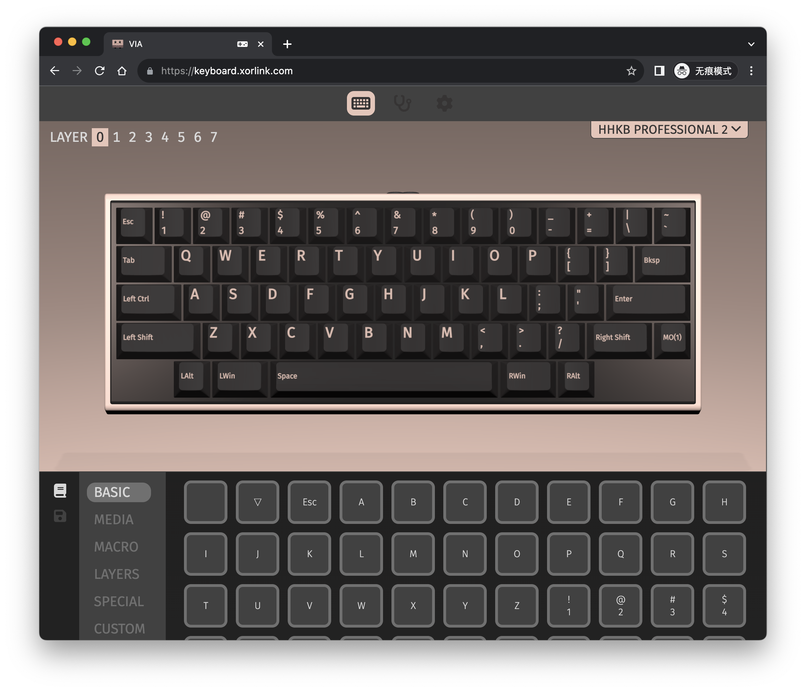

# 键位自定义
通过 Web App，以图形交互的方式，完成键位的实时更新。
这里使用的 App 是一个名为 VIA 的[开源项目](https://github.com/the-via/app)，感谢作者的开源。
## 准备
1. 更新键盘固件，需 V1.3.0 及以上版本固件。
2. 浏览器跟键盘进行通讯，会使用到一个高级功能，目前仅 Chrome、Edge、Opera 的较新版本支持此功能。意味着接下来的操作，你需要在上述几款浏览器下进行。

## 入门
1. 访问 [改键主页](https://keyboard.xorlink.com)，第一次访问较慢，请耐心等待。

    如果出现以下提示，说明当前使用的浏览器不支持一先提到的高级功能，请更换浏览器或升级到最新版本。

2. 键盘通过 USB 线连接到 PC，确保键盘被操作系统正确识别。
3. 网页上点击 “Authorize device” 按钮，此时弹出一个对话框，显示我们的设备 “HHKB Professional”。
4. 选中 ”HHKB Professional“，点击“连接”按钮，进入到改键页面，如下图。

页面上方展示的是键盘及当前键位，左上角 LAYER 序号可切换键位层，共八层。页面下方展示的是可设置的键值。

改键操作很简单，首先页面上方选中需要修改的按键，然后下方点击目标键值，随即便完成了改键。整个改键交互是实时的，当你操作完成后，关闭网页即可。

## 进阶
页面左下角，有 BASIC、MEDIA、MACRO、LAYERS、SPECIAL、CUSTOM 几个菜单。下面逐一介绍。
### BASIC
最常用的按键。
### LAYERS
层切换键。

MO(n) 表示按下此键并保持时，键盘会切换到第 n 层。当按键释放后，又切换回当前层。注意最下面一层为第 0 层。

以默认的第 0 层为例，右下角按键被设置为 MO(1)，按下此键，键位会立即切换到第 1 层，此时最上面一排的数字键变成了 F 键。释放后，键位又恢复为第 0 层。

这里需要特别注意：第 0 层 MO(1) 对应的按键在第 1 层为一个倒三角符号。这个符号表示 Transparent -- 透明的。即沿用下一层的功能。

为什么要这样设置呢？因为当按住 MO(1) 时，键位切换到第 1 层，此时该键仍为 MO(1)，保持不变，即一直停留在该层。然后我们就可以在保持此键按下的同时按其它键，实现组合键功能。当 MO(1) 释放后，又自动回到第 0 层。一般 MO(n) 的上一层对应按键都需要设置为 Transparent，即倒三角符号，以便在按键释放时能回到之前的层。

### MEDIA
媒体键。暂时不支持该功能。
注意： 默认的音量控制键仅支持 macOS，与这里所展示的按键不同。
### MACRO
宏定义键，暂时不支持该功能。
### SPECIAL
特殊功能按键。
### CUSTOM
用户自定义按键。键盘睡眠、蓝牙配对等键均在此。

## 注意事项

1. 配置菜单（CONFIG）中的 “RESET” 选项提供将键盘配置和键位恢复到出厂设置的功能，当键位异常或更改混乱之后，可通过此操作恢复到出厂设置。
2. 改键操作之后的新键位，会在键盘进入自动睡眠时进行自动保存。也可以在配置菜单中的 “SAVE” 选项中执行保持当前配置的操作。

