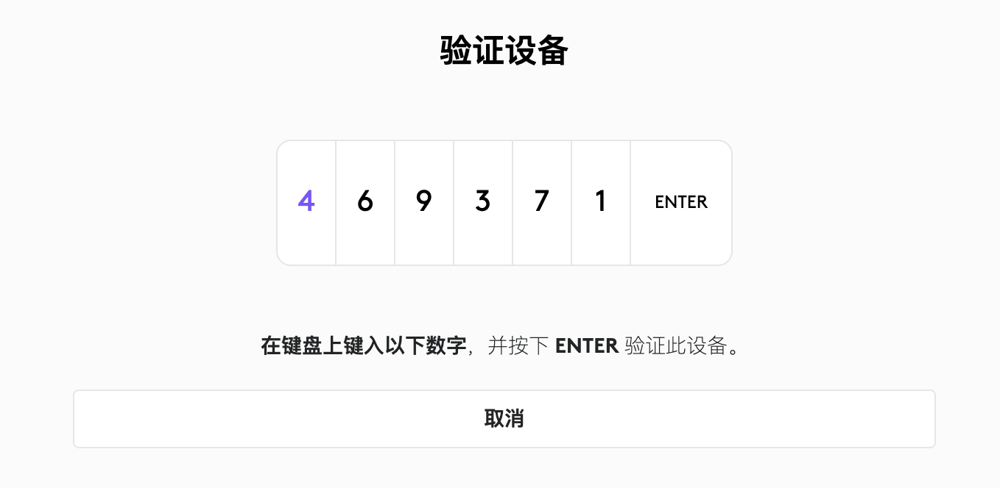
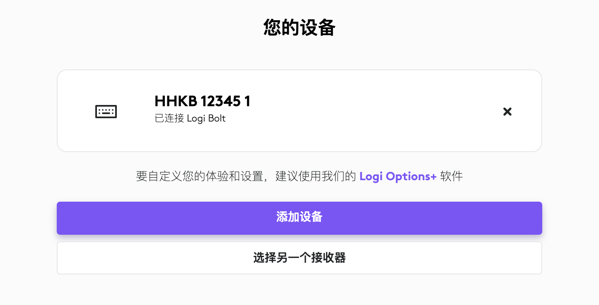

#  Logi Bolt 无线连接
Bolt 是罗技的下一代无线技术。当兼容的鼠标和键盘通过 Bolt USB 接收器连接时，可提供高性能、安全的无线连接。

自 V1.5.0 固件起，HHKB DMC 已支持 Bolt 连接方式，兼容罗技 Bolt USB 接收器（Logi USB Bolt Receiver）。这意味着用户可以将改装后的 HHKB 键盘直接与现有的罗技 Bolt 接收器进行配对连接使用。

下面介绍如何与罗技 Bolt 接收器进行配对连接。

## Bolt 配对
### Logitech Web Connect
将键盘与 Bolt 接收器进行连接，不需要安装任何软件。

只需要浏览器访问 https://logiwebconnect.com 这个网页。然后根据网页提示一步步操作，正确识别到接收器后，即可进行添加设备等操作。

首次连接配对与蓝牙连接一样，需要输入 6 位数配对码，如下图：

🔔 配对码输入过程中，可按 Delete 或 Backspace 键清除错误按键。6 位数配对码输入完成后，按回车键确认配对。

连接完成后，键盘名称下方会显示一行小字： “已连接 Logi Bolt” 。如下图：

## Bolt 多设备绑定和切换
Bolt 连接与蓝牙连接一样，支持多设备绑定和切换，操作快捷键也一致，具体操作请参考[多设备绑定和切换](./mutil_bond.md)章节。

## 兼容的接收器
当前市面上所有的 Logi Bolt USB 接收器均完美支持。