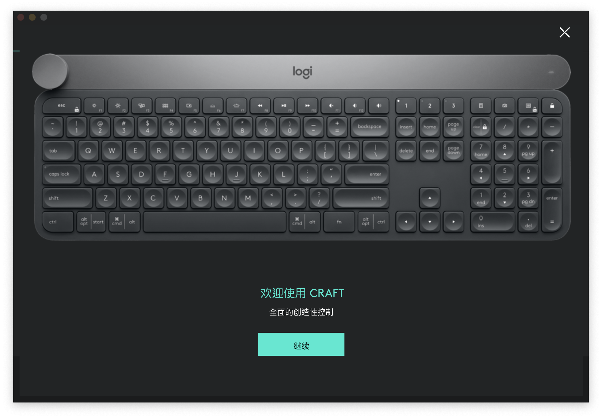

# 使用 Logitech Flow
## 什么是 Logitech Flow
罗技官方对该功能定义如下：
> 使用 Logitech Flow，您可通过将鼠标光标移至屏幕边缘，在不同计算机之间自动切换。 您还可以在不同计算机之间复制和粘贴文本、图片和文件。 如果您有支持该功能的 Logitech 键盘，则键盘可以随着鼠标切换，从而实现完全控制。

## 如何使用 Logitech Flow
使用该功能的前提是首先要有一个支持 Logitech Flow(后文简称 Flow) 功能的鼠标，然后需要安装 [Logitech Options](https://support.logi.com/hc/zh-cn/articles/360025297893)（后文简称 Options） 软件，之后请参考[罗技官方教程](https://support.logi.com/hc/zh-cn/articles/360023188134)。 Options 会将我们的 HHKB 识别为 Craft 键盘。如下图：

