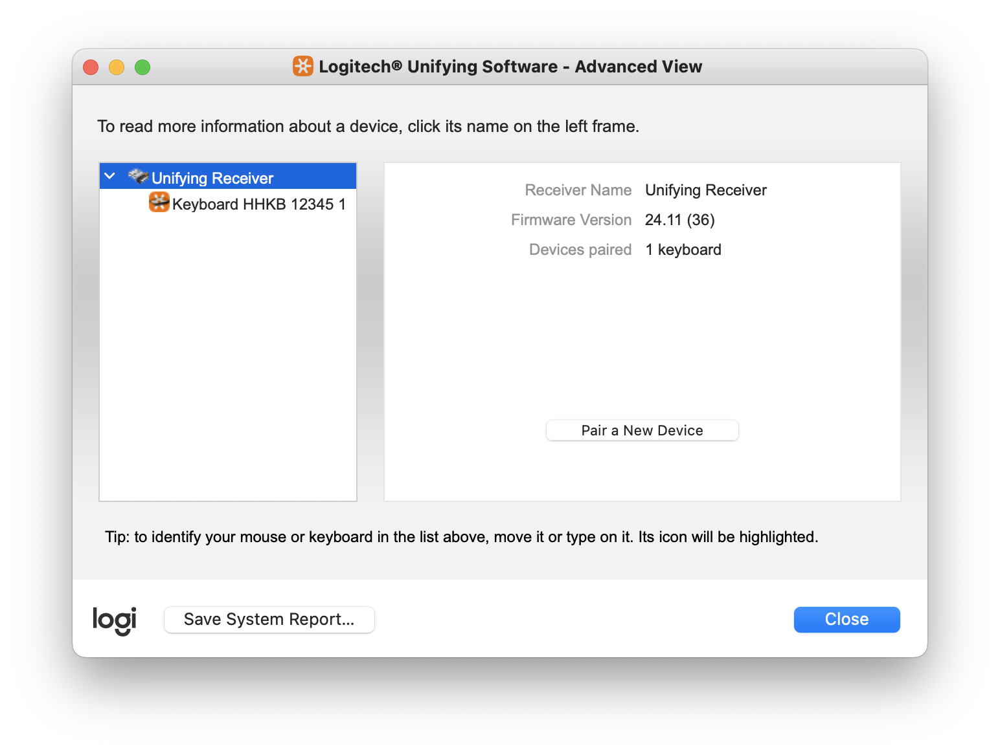
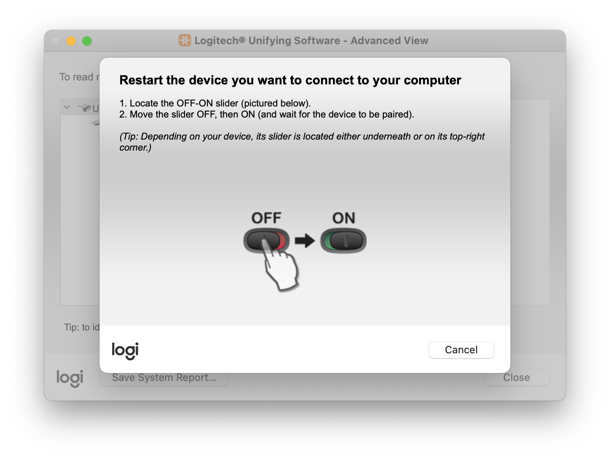
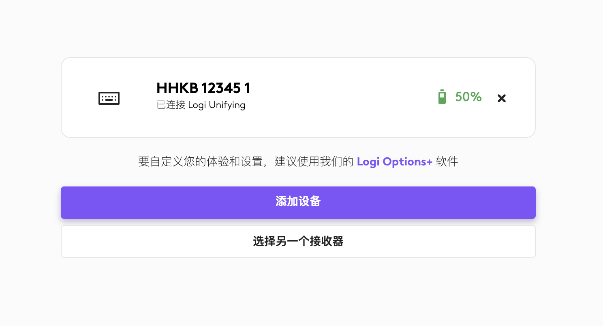

# 2.4G Unifying 优联连接
Unifying 是罗技 Unifying 优联无线技术。最多可以将六个罗技 Unifying 优联无线鼠标或键盘连接至一只小巧又节省空间的 Unifying 优联 USB 接收器。

自 V1.4.0 固件起，HHKB DMC 已支持 2.4G Unifying 优联连接方式，兼容罗技 USB 优联接收器（Logitech USB Unifying Receiver）。这意味着用户可以将改装后的 HHKB 键盘直接与现有的罗技优联接收器进行配对连接使用。

下面介绍如何与罗技优联接收器进行配对连接。

## Unifying 优联配对
需要使用到罗技提供的软件。有两种方式，一种是使用 **[Logitech Unifying Software](https://support.logi.com/hc/en-au/articles/360025297913-Unifying-Software)**, 另一种是使用 **Logitech Web Connect**。下面分别进行介绍。

### Logitech Unifying Software
这种是传统的方式。首先确保优联接收器已插入电脑，然后打开 **[Logitech Unifying Software](https://support.logi.com/hc/en-au/articles/360025297913-Unifying-Software)**，点击左下角的 `Advanced...` 按钮，进入到高级视图。如果优联接收器被正确识别，可在左侧列表显示。

单击鼠标左键选中左侧列表的 `Unifying Receiver`，之后单击右侧窗口的 `Pair a New Device` 按钮，接收器将进入搜索模式，开始查找附近的优联设备。如下图所示：

接下来操作键盘进入配对模式。方法与蓝牙配对操作相同，即长按 `Fn + 右 Alt + 1 、 2 、 3 、 4` 3 秒以上。此时键盘蓝色 LED 灯开始快速闪烁，正常情况下，键盘与接收器会立刻完成配对。同时电脑端界面回到之前的状态，左侧列表可看到刚刚配对好的键盘。

⚠️⚠️⚠️
1. 需要电脑端先操作优联接收器进入配对模式，再操作键盘进入配对模式。

2. 若配对超时失败，请调整键盘位置，使其尽量靠近接收器后再试。

### Logitech Web Connect
采用这种方式，不需要安装任何软件。

与 Bolt 连接一样，只需要浏览器访问 https://logiwebconnect.com 这个网页。然后根据网页提示一步步操作，正确识别到接收器后，即可进行添加设备等操作。

连接完成后，键盘名称下方会显示一行小字： “已连接 Logi Unifying” 。如下图：

添加设备跟使用 **[Logitech Unifying Software](https://support.logi.com/hc/en-au/articles/360025297913-Unifying-Software)** 时的操作一样，均是接收器先进入配对模式，显示搜索设备，再操作键盘进入配对模式。

## Unifying 优联多设备绑定和切换
2.4G Unifying 优联连接与蓝牙连接一样，支持多设备绑定和切换，操作快捷键也一致，具体操作请参考[多设备绑定和切换](./mutil_bond.md)章节。

## 兼容的接收器
理论上兼容所有的罗技优联接收器，当前已测试过可兼容的接收器型号有 `C-U0007`、`C-U0008`、`C-U0012`。推荐搭配 `C-U0008`使用。