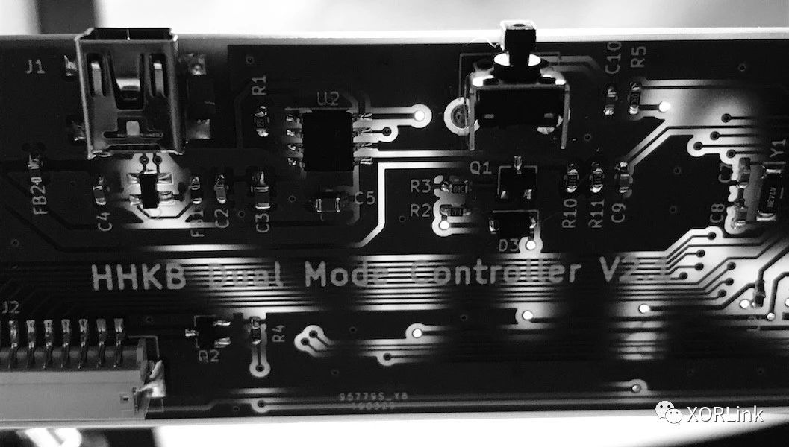

# 产品介绍

## 设计背景
**2019年**

手里有一把 HHKB Professional 2，Type-S 版本。该版本于 2011 年上市销售至今，与之相似的 Professional 2 于 2006 年推出。两者的区别仅仅是前者使用起来噪音更小一些。这两款键盘均只支持 USB 连接。而最新款（截止2019年）的 BT 版本，支持蓝牙连接，却不支持 USB 连接。并且其蓝牙为 3.0 版本，非低功耗蓝牙（BLE），且只能工作于蓝牙模式。其翘臀的电池仓设计也让人累觉不爱。于是乎就有了接下来的东西。

**2023年**

原版 HHKB Professional BT 键盘为蓝牙 3.0，不仅功耗高，而且仅支持蓝牙一种连接方式。作为一把大多数程序员都喜爱的键盘，每天数小时的高强度使用场景下，续航成为了其中一短板。本人之前将有线版本的 HHKB Pro 2 改造为双模之后，使用体验得到较大提升，也得到了不少网友的好评。于是将目光又落向了 HHKB Professional BT，希望通过此拙作，再次给大家带来惊喜。

## 产品简介

这是一款双模键盘控制器，用以替换 HHKB 键盘原有的控制器。该控制器支持 USB 和蓝牙（BLE）同时连接。如果你有两台主机，一台通过 USB 连接，一台通过蓝牙连接。一个键盘就可以在两台设备之间无缝切换。此外蓝牙还支持多设备绑定和切换。其中 HHKB Pro 2 控制板设计有锂电池充电功能，键盘内装入一块锂电池，即可变身为一款无线双模键盘。控制器使用最新的蓝牙芯片，支持蓝牙 5.0 特性。升级你的 HHKB 键盘非常简单，拆下原有控制板，替换即可。

## 产品特点
两款键盘控制器具有如下特点。
* 支持 USB 和蓝牙输入两种模式。
* 使用最新低功耗蓝牙芯片。相比传统蓝牙，功耗更低，带来更长续航，且支持蓝牙 5.0 特性。
* 蓝牙支持多设备绑定和切换。
* 支持罗技 Logitech Flow 功能。配合部分罗技鼠标，实现键鼠无缝切换。
* HHKB Pro 2 主控集成锂电池充电管理功能。装入锂电池，变身无线键盘，摆脱有线束缚。
* 完善的功耗优化。HHKB Pro 2 主控蓝牙模式下，按每天 8 小时使用时间计算，2000mAh 电池可使用约一个半月。HHKB Pro BT 主控有比原版更长的续航，电池模式下续航可达数月。